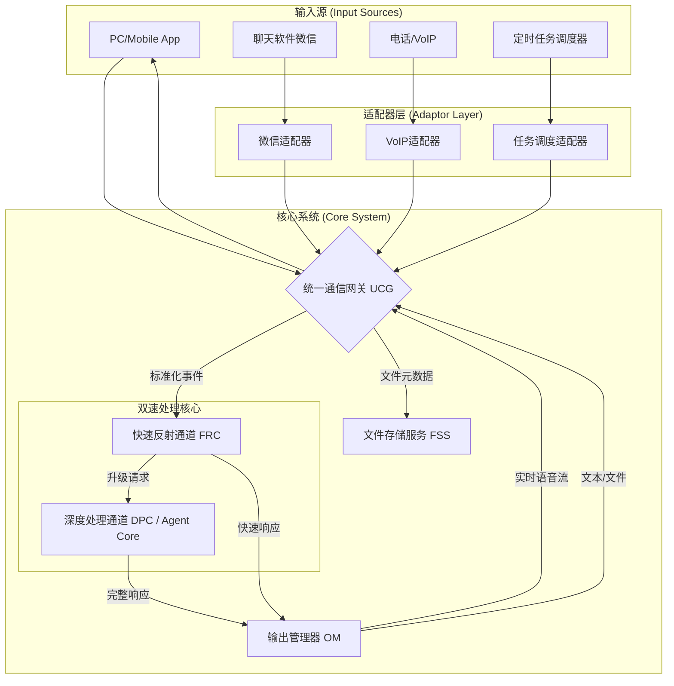

# **EchoFlow-Agent 系统设计文档: V1.0 - 核心架构与协议规范**

## 1. 文档引言

### 1.1. 文档目的
本文档（版本 1.0）是 EchoFlow-Agent 系统的最高级别设计规范。它定义了系统的整体架构、模块职责、通信协议、数据结构以及核心工作流程。所有后续的详细设计和开发工作都必须严格遵守本规范。

### 1.2. 核心原则
*   **规范优于实现 (Specification over Implementation)**: 任何开发活动都必须以本文档为准绳。当实现与规范冲突时，应优先修订规范再进行开发。
*   **模块化与解耦 (Modularity & Decoupling)**: 各模块功能独立、职责清晰，通过标准化的接口进行通信，降低系统复杂度，提高可维护性。
*   **双速架构 (Dual-Speed Architecture)**: 系统内置“**快速反射通道**”和“**深度处理通道**”，以平衡极致响应速度和强大任务处理能力。
*   **统一数据模型 (Unified Data Model)**: 所有在系统内部流转的信息都必须遵循统一的数据结构，以实现无缝处理和路由。

## 2. 系统整体架构

系统采用基于 **FastAPI** 的微服务化架构，由**统一通信网关 (UCG)**、**输入适配器层**、**双速处理核心**和**输出管理器**组成。



## 3. 模块设计规范

### 3.1. 统一通信网关 (Unified Communication Gateway - UCG)
*   **技术栈**: FastAPI 应用, Uvicorn 服务器。
*   **职责**:
    1.  作为系统唯一面向公网的入口点。
    2.  处理用户身份验证与会话管理。
    3.  提供标准化的 **HTTP/S** 和 **WebSocket Secure (WSS)** 端点。
    4.  接收所有来自客户端和适配器的请求。
    5.  将所有输入数据转换为**标准化事件对象 (Standard Event Object - SEO)**。
    6.  将SEO路由到**快速反射通道 (FRC)**。
    7.  与**文件存储服务 (FSS)** 协作处理文件上传。
    8.  将**输出管理器 (OM)** 生成的响应传递回相应的客户端。

### 3.2. 输入适配器层 (Adaptor Layer)
*   **职责**: 将非标准化的第三方平台输入转换为UCG可以理解的标准化请求。
    *   **微信适配器**: 将微信消息（文本、语音、图片、文件）转换为对UCG的HTTP/S调用。
    *   **VoIP适配器**: 建立与PSTN/VoIP平台的媒体流连接，并将实时音频流通过WSS转发至UCG。
    *   **任务调度适配器**: 一个内部服务（如基于`apscheduler`或Cron Job），在预定时间生成一个SEO并将其推送至UCG。

### 3.3. 文件存储服务 (FSS)
*   **技术选型**: 本地部署的 **MinIO** (兼容S3协议) 或云厂商对象存储 (如AWS S3)。
*   **职责**:
    1.  提供安全、可扩展的文件存储能力。
    2.  通过UCG生成临时的预签名上传/下载URL，实现客户端直传，减轻UCG负载。
    3.  存储所有用户上传的文件，并提供唯一的`file_id`。

### 3.4. 快速反射通道 (Fast Reflex Channel - FRC)
*   **位置**: 核心系统内部模块，由本地LLM驱动。
*   **职责**:
    1.  接收来自UCG的所有SEO。
    2.  进行初步的、极速的决策。
    3.  **对于纯信息类输入**: 立即生成一个临时的、安抚性的响应（如“好的，正在处理…”），或直接回答简单问题。
    4.  **对于包含文件或复杂指令的输入**: 生成一个确认收到的响应（如“文件已收到，我将开始分析…”）。
    5.  **决策升级**: 判断当前任务是否需要**深度处理通道 (DPC)**。如果需要，向DPC发出一个包含完整上下文的“任务升级”请求。
    6.  将所有生成的快速响应发送至**输出管理器 (OM)**。

### 3.5. 深度处理通道 (Deep Processing Channel - DPC) / Agent Core
*   **职责**:
    1.  接收来自FRC的任务升级请求。
    2.  执行所有复杂的、耗时的任务，包括但不限于：
        *   多步工具调用。
        *   数据库查询与操作。
        *   与外部系统进行MCP通信。
        *   对FSS中的文件进行深度分析。
    3.  生成包含文本、文件等多种媒介的完整、详尽的响应。
    4.  将完整响应发送至**输出管理器 (OM)**。

### 3.6. 输出管理器 (Output Manager - OM)
*   **职责**:
    1.  接收来自FRC和DPC的响应指令。
    2.  根据指令类型进行处理：
        *   **实时语音合成**: 将文本流通过API（如ElevenLabs）转换为音频流，并通过WSS实时推送到客户端。
        *   **文本消息**: 封装成标准消息格式。
        *   **文件发送**: 从FSS获取文件的预签名下载URL，并封装。
    3.  将格式化后的最终响应发送回UCG，由UCG分发给目标客户端。

## 4. 数据协议与格式规范

### 4.1. 标准化事件对象 (Standard Event Object - SEO)
这是系统内部信息流转的原子单位，由Pydantic模型定义。

```python
# pydantic_models.py

class FileMetadata(BaseModel):
    file_id: str
    filename: str
    mime_type: str
    size_bytes: int

class Content(BaseModel):
    type: Literal["text", "realtime_speech_chunk", "file_placeholder"]
    data: Any # text: str, speech_chunk: bytes

class InputEvent(BaseModel):
    event_id: UUID = Field(default_factory=uuid.uuid4)
    session_id: UUID
    user_id: str
    timestamp: datetime = Field(default_factory=datetime.utcnow)
    source_platform: Literal["app", "wechat", "phone", "scheduler"]
    
    # 核心内容
    text_content: Optional[str] = None # ASR转换后的最终文本
    speech_chunk: Optional[bytes] = None # 实时语音数据块
    files: List[FileMetadata] = [] # 关联的文件列表

```
**流程**:
1.  客户端/适配器发送原始信息。
2.  UCG中的ASR模块（如Deepgram）将语音/实时通话信息转换为`text_content`。文件上传流程完成后，文件信息填入`files`列表。
3.  完整的`InputEvent`被创建并送入FRC。

### 4.2. 响应指令对象 (Response Instruction Object - RIO)
由FRC或DPC生成，指导OM如何构建并发送响应。

```python
# pydantic_models.py

class ResponseContent(BaseModel):
    type: Literal["text", "speech_stream", "file_download"]
    data: Any # text: str, speech_stream: str (text to be synthesized), file_download: str (file_id)

class ResponseInstruction(BaseModel):
    response_to_event_id: UUID
    session_id: UUID
    is_final_response: bool # 区分是FRC的临时响应还是DPC的最终响应
    content: List[ResponseContent]
    playback_config: Dict[str, Any] = {"autoplay_speech": True} # 控制客户端行为
```

## 5. 核心工作流程规范

### 5.1. 实时语音对话流程
1.  **客户端**: 与UCG建立WSS连接，持续发送PCM音频块。
2.  **UCG**: 将音频流实时转发给ASR服务。ASR返回的文本被实时组装进一个`InputEvent`的`text_content`字段。
3.  **FRC**: 接收到`InputEvent`后，立即生成一个`ResponseInstruction`，`content.type`为`speech_stream`。
4.  **OM**: 接收到指令，立即将文本流送至TTS服务，并将返回的音频流通过WSS推回客户端。
5.  整个过程延迟极低，形成流畅对话。

### 5.2. 文件上传与处理流程
1.  **客户端**: 调用UCG的`/presign-upload`端点，获取上传URL和`file_id`。
2.  **客户端**: 将文件直传至FSS。
3.  **客户端**: 发送一个包含`text_content`（如“帮我分析这份报告”）和`files`列表（包含`file_id`和元数据）的HTTP/S请求至UCG。
4.  **UCG**: 创建`InputEvent`并送至FRC。
5.  **FRC**: 立即生成快速响应（如“文件已收到，分析需要一些时间”），并通过OM返回给用户。同时，向DPC发出任务升级请求，附带完整的`InputEvent`。
6.  **DPC**: 在后台开始处理。它可以通过`file_id`向FSS请求文件的临时访问权限，进行深度分析。
7.  **DPC**: 处理完成后，生成包含分析结果的最终`ResponseInstruction`，通过OM返回给用户。
