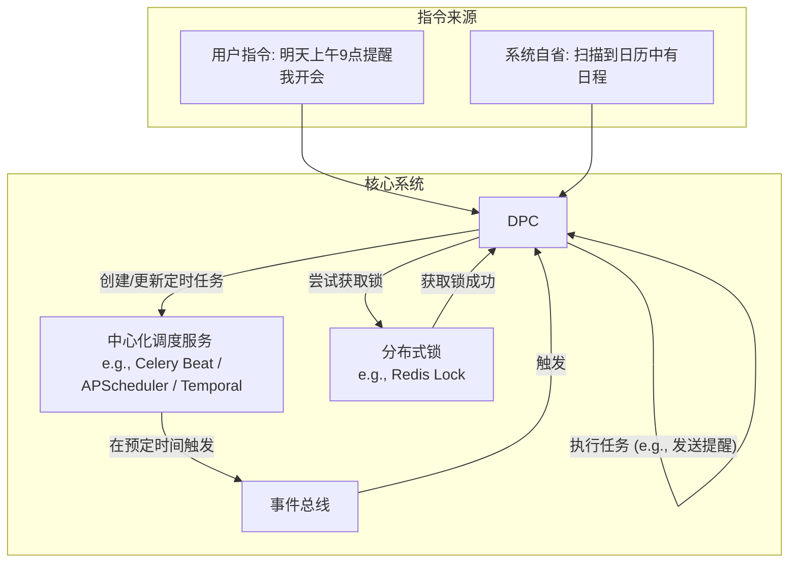

### **2. 定时任务与事件触发系统 (The "Timekeeper" & Scheduler)**

您的需求涵盖了**用户定义的调度 (User-defined Scheduling)** 和 **系统自省的调度 (System-driven Scheduling)**。我们将采用一个**中心化的调度服务**结合**分布式锁**来实现。

#### **核心架构：调度服务 + 事件总线**

#### **规范性方案与设计解析**

1.  **调度引擎: 中心化调度服务**
    *   **规范方案**:
        *   **`Celery` (with Celery Beat)**: Python生态中最强大、最成熟的分布式任务队列系统。`Celery Beat`是其内置的调度器。
        *   **`APScheduler`**: 一个功能强大且相对轻量级的Python调度库，可以嵌入到任何应用中。
        *   **`Temporal.io`**: 一个更现代、更强大的工作流编排引擎，提供了远超简单调度的可靠性保证（如重试、事务、补偿）。
    *   **选择建议**: 对于我们的项目，从**`APScheduler`**开始是最简单、最快速的。当未来任务调度逻辑变得极其复杂时，再考虑迁移到`Celery`或`Temporal`。
    *   **工作模式**: DPC在解析到用户的定时指令后，会调用调度服务的API，注册一个新任务，包含**触发时间 (trigger time)**和**要执行的操作 (payload)**，这个操作通常就是向事件总线发布一个特定事件。

2.  **任务执行: 依然是事件驱动**
    *   **规范方案**: **调度器不直接执行业务逻辑**。
    *   **工作流程**:
        1.  当`APScheduler`到达预定时间，它的唯一工作就是向我们的**事件总线**（同上，RabbitMQ/Redis Streams）发布一个事件，例如 `{"event_type": "reminder_triggered", "user_id": "...", "reminder_text": "开会"}`。
        2.  DPC（或其他专门的“执行者”服务）监听这些`..._triggered`事件，并执行相应的业务逻辑（如调用TTS生成语音提醒，或执行一个自动化脚本）。
    *   **为什么这么做**: 同样是为了**解耦**。调度器只负责“计时”，执行者只负责“干活”。我们可以轻松地增加或修改执行者的逻辑，而无需触碰脆弱的调度系统。

3.  **可靠性与幂等性: 分布式锁 (Distributed Lock)**
    *   **问题**: 如果未来我们的DPC为了性能扩展为多个实例，当一个定时任务触发时，所有实例都会收到事件，可能会导致**同一个提醒被发送多次**。
    *   **规范方案**: 使用基于**Redis**的分布式锁（如`RedLock`算法的实现）。
    *   **工作流程**:
        1.  当一个DPC实例收到一个触发事件时，它首先尝试获取一个与该事件相关的、唯一的**锁**，例如`lock:reminder:event_id_123`。
        2.  **只有第一个成功获取到锁的实例**，才能继续执行任务。
        3.  其他实例因为获取锁失败，会直接放弃执行。
        4.  执行完成后，获锁的实例释放锁。
    *   **为什么这么做**: 这保证了即使在分布式环境下，一个定时任务也**只会被精确地执行一次 (Exactly-once delivery)**，这是构建可靠系统的基石。

**总结**:
*   对于**文件处理**，核心是**对象存储 + 预签名URL + 事件驱动的异步处理**。
*   对于**定时任务**，核心是**中心化调度器 + 事件总线 + 分布式锁**。

这些方案都采用了业界最成熟、最可靠的设计模式，能确保我们的EchoFlow系统在添加这些高级功能后，依然保持高性能、高可用和高扩展性。