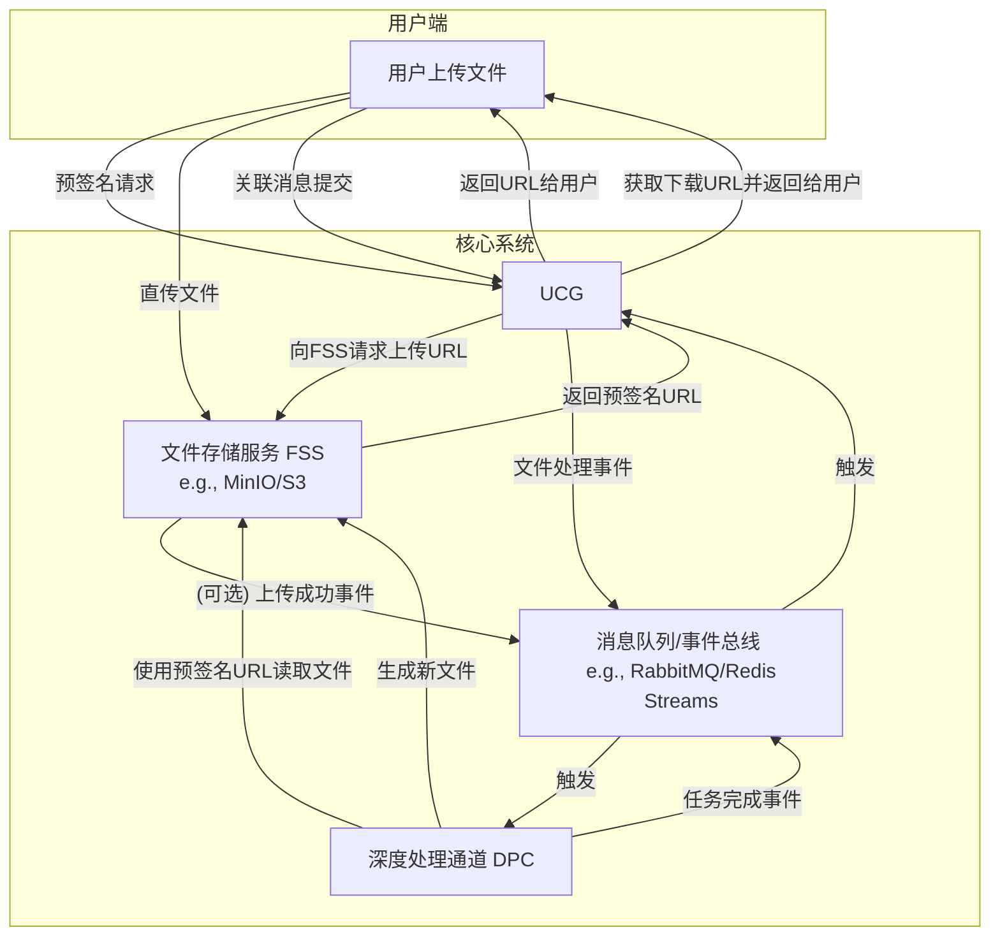

### **1. 文件传输与处理的系统架构 (The "Digital Logistics" System)**

您的需求分析非常全面，涵盖了文件生命周期的三个核心阶段：**流入 (Ingestion)、处理 (Processing)、流出 (Egestion)**。我们将为此设计一个基于**对象存储**和**事件驱动**的健壮架构。

#### **核心架构：事件驱动 + 对象存储**

#### **规范性方案与设计解析**

1.  **文件存储: 对象存储 (Object Storage)**
    *   **规范方案**: **Amazon S3 (Simple Storage Service)** 是事实上的行业标准。对于本地部署，**MinIO** 是一个100%兼容S3 API的开源替代品。
    *   **为什么用它**:
        *   **无限扩展**: 可以存储几乎无限数量和大小的文件。
        *   **高可用与持久性**: 提供了极高的数据可靠性。
        *   **API驱动**: 所有操作（上传、下载、权限管理）都通过API进行，完美契合我们的自动化需求。
        *   **预签名URL (Presigned URLs)**: 这是**核心**！它允许我们的UCG临时授权用户直接与存储服务交互，而无需让大文件流量经过UCG本身。这极大地降低了UCG的负载和带宽成本，提升了上传/下载速度。

2.  **文件流入: UCG协调的客户端直传**
    *   **规范方案**:
        1.  客户端先向UCG发送一个“我要上传文件”的元数据请求。
        2.  UCG调用FSS（MinIO/S3）的API，生成一个有时效性（如15分钟内有效）的、一次性的**预签名上传URL**。
        3.  UCG将这个URL返回给客户端。
        4.  客户端使用这个URL，通过标准的HTTP PUT请求，**直接将文件上传到对象存储**。
        5.  上传成功后，客户端再向UCG发送一条消息，包含文件的唯一标识符，告诉UCG“我传完了，请处理”。
    *   **为什么这么做**: 这是**性能和安全**的最佳实践。UCG只处理轻量级的元数据和信令，而繁重的文件传输任务被卸载到了专业的对象存储服务上。

3.  **文件处理: 事件驱动的异步工作流**
    *   **规范方案**: 使用**消息队列 (Message Queue)** 或 **事件总线 (Event Bus)**，如RabbitMQ, Redis Streams, 或云厂商的SQS/EventBridge。
    *   **工作流程**:
        1.  当UCG收到“文件处理”的指令后，它**不直接调用**DPC。
        2.  而是向消息队列中发布一个**事件 (Event)**，例如 `{"event_type": "file_processing_requested", "file_id": "...", "user_id": "...", "prompt": "..."}`。
        3.  DPC作为一个**消费者 (Consumer)**，长期监听这个队列。
        4.  当DPC从队列中取到事件后，它才开始工作。它使用`file_id`向FSS获取一个**预签名读取URL**，下载文件进行分析，生成新文件再上传，最后再向队列发布一个`file_processing_completed`事件。
    *   **为什么这么做**:
        *   **解耦 (Decoupling)**: UCG和DPC完全解耦。UCG不关心DPC如何处理，DPC也不关心事件从何而来。
        *   **异步与削峰填谷 (Asynchronous & Load Leveling)**: 文件处理可能是非常耗时的任务。如果用户同时上传100个文件，UCG只需瞬间向队列写入100条消息即可，不会被阻塞。DPC可以按照自己的节奏，一个一个地处理这些任务，避免了系统过载。
        *   **可靠性**: 如果DPC在处理任务时崩溃了，消息仍然安全地存放在队列中。当DPC重启后，可以继续处理，保证了任务不丢失。