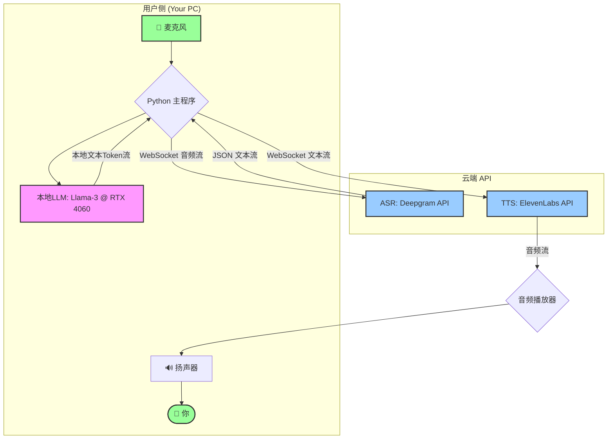

# **项目 "EchoFlow": 低延迟混合动力AI语音助手开发文档**

## 1. 项目目标

本项目旨在构建一个高性能、低延迟、支持打断的个人AI语音助手。其核心体验对标“豆包”等业界领先产品，通过创新的**本地+云端混合架构**，在个人电脑（拯救者R9000P, RTX 4060 8GB）上实现极致的响应速度和交互流畅度，同时将成本降至最低。

## 2. 核心架构 (Hybrid Architecture)

我们将采用“各取所长”的策略，将计算任务分配给最适合它的地方：



**数据流解析:**
1.  **ASR (云端)**: 你的语音通过WebSocket实时流向Deepgram，后者将识别出的文字流实时返回。
2.  **LLM (本地)**: 程序接收到ASR的文字后，立刻送入在你RTX 4060上运行的本地大模型。模型以Token流的形式高速生成回应。
3.  **TTS (云端)**: 本地LLM生成的每一个文字Token，都立刻通过WebSocket流向ElevenLabs，后者合成对应的音频流并返回播放。

## 3. 技术栈 (Tech Stack)

*   **编程语言**: Python 3.10+
*   **核心框架**: `asyncio` (用于处理并发的I/O密集型任务)
*   **本地LLM**: `llama-cpp-python` (利用CUDA在NVIDIA GPU上运行GGUF模型)
*   **语音识别 (ASR)**: `deepgram-sdk`
*   **语音合成 (TTS)**: `elevenlabs`
*   **音频处理**: `sounddevice` / `pyaudio` (用于捕获麦克风输入)
*   **环境管理**: `python-dotenv` (用于管理API密钥)

## 4. Phase 1: 环境配置 (Environment Setup)

> **操作系统**: Ubuntu (已安装，非常好！)

#### 4.1. NVIDIA 驱动与CUDA
确保你的NVIDIA驱动和CUDA Toolkit已正确安装。通过在终端运行 `nvidia-smi` 来验证。你应该能看到你的RTX 4060的信息。

#### 4.2. Python 虚拟环境
强烈建议使用虚拟环境以隔离项目依赖。

```bash
# 在你的项目文件夹下
python3 -m venv venv
source venv/bin/activate
```

#### 4.3. 安装Python依赖
最关键的一步是正确安装 `llama-cpp-python` 以启用CUDA加速。

```bash
# 1. 安装核心依赖
pip install python-dotenv deepgram-sdk elevenlabs sounddevice numpy websockets aiohttp

# 2. 安装带CUDA支持的llama-cpp-python (此命令会自动编译)
# CMAKE_ARGS环境变量会告诉编译器启用CUBLAS支持
CMAKE_ARGS="-DLLAMA_CUBLAS=on" FORCE_CMAKE=1 pip install llama-cpp-python
```

#### 4.4. 下载本地LLM模型
1.  访问 Hugging Face (hf.co)。
2.  搜索 `Meta-Llama-3-8B-Instruct-GGUF`。
3.  从文件列表中下载一个4位或5位的量化版本，例如 `Meta-Llama-3-8B-Instruct.Q4_K_M.gguf`。
4.  将下载的模型文件（约4.7GB）放入你的项目文件夹下的 `models/` 目录中。

#### 4.5. 配置API密钥
1.  在项目根目录创建一个名为 `.env` 的文件。
2.  前往 [Deepgram](https://deepgram.com/) 和 [ElevenLabs](https://elevenlabs.io/) 官网注册并获取你的API Key。
3.  将密钥写入 `.env` 文件：

    ```env
    DEEPGRAM_API_KEY="your_deepgram_api_key_here"
    ELEVENLABS_API_KEY="your_elevenlabs_api_key_here"
    ```

## 5. Phase 2: 代码实现 (Implementation)

建议的项目文件结构：

```
/project_echoflow/
|-- venv/
|-- models/
|   |-- Meta-Llama-3-8B-Instruct.Q4_K_M.gguf
|-- .env
|-- config.py         # 存放所有配置
|-- main.py           # 主程序，调度中心
|-- asr_handler.py    # 处理语音识别
|-- llm_handler.py    # 处理本地LLM推理
|-- tts_handler.py    # 处理语音合成与播放
```

---

### `config.py`
```python
import os
from dotenv import load_dotenv

load_dotenv()

# API Keys
DEEPGRAM_API_KEY = os.getenv("DEEPGRAM_API_KEY")
ELEVENLABS_API_KEY = os.getenv("ELEVENLABS_API_KEY")

# LLM Configuration
MODEL_PATH = "models/Meta-Llama-3-8B-Instruct.Q4_K_M.gguf"
N_GPU_LAYERS = 35  # 关键参数! 根据你的VRAM调整，35对8GB来说是个很好的起点
N_CTX = 4096       # 上下文长度

# Audio Configuration
MIC_SAMPLE_RATE = 16000
MIC_CHANNELS = 1
MIC_DEVICE_ID = None # `None` for default mic

# TTS Configuration
ELEVENLABS_VOICE_ID = "Rachel" # 你可以选择任何你喜欢的声音

# Prompt
SYSTEM_PROMPT = "You are Echo, a highly responsive and friendly AI assistant. You answer concisely and clearly."
```

---

### `llm_handler.py` (本地大脑)
```python
import asyncio
from llama_cpp import Llama
import config

class LLMHandler:
    def __init__(self, from_asr_queue, to_tts_queue):
        self.from_asr_queue = from_asr_queue
        self.to_tts_queue = to_tts_queue
        print("Initializing Llama model...")
        self.llm = Llama(
            model_path=config.MODEL_PATH,
            n_gpu_layers=config.N_GPU_LAYERS,
            n_ctx=config.N_CTX,
            verbose=True # 设为True方便调试
        )
        print("Llama model initialized successfully on GPU.")
        self.conversation_history = [{"role": "system", "content": config.SYSTEM_PROMPT}]

    async def process_llm_responses(self):
        while True:
            text_input = await self.from_asr_queue.get()
            print(f"LLM received: {text_input}")
            
            self.conversation_history.append({"role": "user", "content": text_input})
            
            ai_response_chunks = []
            
            # 使用流式生成
            stream = self.llm.create_chat_completion(
                messages=self.conversation_history,
                stream=True,
            )
            
            for chunk in stream:
                delta = chunk['choices'][0]['delta']
                if 'content' in delta and delta['content']:
                    token = delta['content']
                    ai_response_chunks.append(token)
                    await self.to_tts_queue.put(token) # 关键：立即将token送去TTS
            
            # 将完整的AI回复存入历史记录
            full_response = "".join(ai_response_chunks)
            self.conversation_history.append({"role": "assistant", "content": full_response})
            print(f"LLM generated: {full_response}")
```

---

### `asr_handler.py` & `tts_handler.py` (概念性代码)

> **给Cursor的提示**: 请使用 `deepgram-sdk` 和 `elevenlabs` 库的异步和流式功能来实现以下逻辑。

#### `asr_handler.py` 逻辑:
- 使用 `asyncio` 和 `websockets` 连接到Deepgram的流式API。
- 使用 `sounddevice.InputStream` 捕获麦克风音频。
- 将音频块实时发送到Deepgram。
- 监听 `LiveTranscriptionEvents.TRANSCRIPT_RECEIVED` 事件。
- 当收到一个`is_final=True`的转录片段时，将其放入 `to_llm_queue`。
- **打断逻辑**: 在此模块中实现一个状态机。如果TTS正在播放时（`is_speaking`状态为True），收到了新的用户语音转录，立即发出一个“打断”信号（例如，通过一个`asyncio.Event`）。

#### `tts_handler.py` 逻辑:
- 创建一个异步生成器函数，它会不断从 `from_llm_queue` 中 `await queue.get()` 来获取文本token。
- 使用 `elevenlabs` 库的 `stream` 功能，并将上述生成器作为输入。
- `elevenlabs.stream` 函数会返回一个音频流，直接使用`elevenlabs.play()`来播放它。
- **打断逻辑**: 监听“打断”信号。如果收到信号，需要立即停止音频播放。这可能需要中断 `elevenlabs.play()` 或管理底层的播放流。

---

### `main.py` (调度中心)
```python
import asyncio
import queue
from llm_handler import LLMHandler
# 导入你将要创建的 ASR 和 TTS 处理器
# from asr_handler import ASRHandler 
# from tts_handler import TTSHandler

async def main():
    # 使用asyncio的队列，因为它们是为协程设计的
    asr_to_llm_queue = asyncio.Queue()
    llm_to_tts_queue = asyncio.Queue()
    
    # 打断事件
    interruption_event = asyncio.Event()

    # 初始化各个模块
    # asr_handler = ASRHandler(asr_to_llm_queue, interruption_event)
    llm_handler = LLMHandler(asr_to_llm_queue, llm_to_tts_queue)
    # tts_handler = TTSHandler(llm_to_tts_queue, interruption_event)

    print("Starting all handlers...")

    # 创建并运行所有任务
    # 这是概念性的，你需要填充 ASR 和 TTS 的具体实现
    asr_task = asyncio.create_task(asr_handler.start_transcribing())
    llm_task = asyncio.create_task(llm_handler.process_llm_responses())
    tts_task = asyncio.create_task(tts_handler.start_speaking())
    
    try:
        await asyncio.gather(asr_task, llm_task, tts_task)
    except asyncio.CancelledError:
        print("Main task cancelled.")
    finally:
        print("Shutting down handlers...")
        # 在这里添加清理逻辑，例如关闭连接

if __name__ == "__main__":
    try:
        asyncio.run(main())
    except KeyboardInterrupt:
        print("\nProgram interrupted by user. Exiting.")

```

## 6. Phase 3: 运行与调试

1.  确保你的虚拟环境已激活 (`source venv/bin/activate`)。
2.  确保 `.env` 文件和模型文件路径正确。
3.  运行主程序: `python main.py`。
4.  观察终端输出。`llama.cpp`的日志会告诉你GPU是否被成功利用。
5.  开始对着麦克风说话，享受你的极速AI助手！

## 7. 下一步与改进

*   **完善打断逻辑**: 实现一个更鲁棒的状态管理器来处理打断，确保任务能被干净地取消和重启。
*   **声音克隆**: 使用ElevenLabs的声音克隆功能，让AI用你自己的声音回答。
*   **添加“思考”音效**: 在ASR识别完成到TTS开始播放之间，播放一个短暂的、非阻塞的音效，提升交互体验。
*   **上下文管理**: 实现更复杂的对话历史管理策略，例如滑动窗口或摘要，以更好地利用有限的`n_ctx`。
