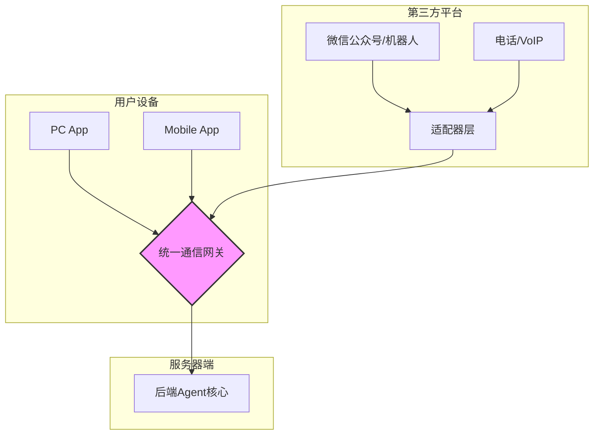

# **EchoFlow-Agent 系统设计文档: Part 1 - 前端与输入处理规范 (FEP-1.0)**

## 1. 文档概述

本文档（FEP-1.0）定义了 EchoFlow-Agent 系统中所有与用户交互的前端（Clients）和输入源（Input Sources）的技术规范。其核心目标是确保无论输入来自何种设备、何种平台、何种数据类型，都能被统一、高效、安全地处理，为后端Agent提供标准化、结构化的输入数据。

**遵循原则**:
*   **平台无关性 (Platform Agnostic)**: 核心逻辑应与具体平台（Windows, Android, iOS, Web）解耦。
*   **多模态就绪 (Multimodality-Ready)**: 设计必须原生支持文本、语音、图像、文件等多种数据类型。
*   **低延迟交互 (Low-Latency Interaction)**: 所有实时交互（如语音）必须采用流式处理，最大化降低感知延迟。
*   **安全与隐私 (Security & Privacy by Design)**: 用户数据在传输和处理过程中必须得到充分保护。

## 2. 客户端架构 (Client Architecture)

所有官方客户端（PC软件、手机App）应遵循统一的**“瘦客户端 + 统一网关”**模型。

*   **瘦客户端 (Thin Client)**: 客户端本身只负责UI渲染、硬件访问（麦克风、摄像头）、原始数据捕获和与网关的安全通信。**不包含任何核心业务逻辑**。
*   **统一通信网关 (Unified Communication Gateway)**: 这是一个中心化的服务器端入口点，负责接收来自所有客户端和第三方集成的请求，进行身份验证、协议转换和初步处理。



## 3. 核心输入类型与处理规范

系统必须能够处理以下核心输入类型，每种类型都有严格的处理规范。

### 3.1. 实时语音 (Real-time Speech)

这是最高优先级的交互方式。

*   **捕获协议**: 客户端必须使用**WebSocket Secure (WSS)** 与统一通信网关建立持久连接。
*   **音频格式**: 原始音频流应采用 **PCM 16-bit, 16kHz, 单声道** 格式。客户端在发送前不对音频进行压缩，以保证最低延迟和最高质量。
*   **流式传输**: 音频数据必须以小块（Chunks）的形式连续不断地发送，每个块的大小建议为 **20-40毫秒** 的音频数据（例如，每秒发送25-50次数据包）。
*   **会话管理**: WebSocket连接建立时，需包含用户认证信息和会话ID，以确保后续所有音频块都与正确的用户会话关联。
*   **打断信号 (Barge-in)**: 客户端在进行语音输出的同时，必须持续监听麦克风。一旦检测到用户语音活动（VAD），客户端应立即通过同一WebSocket连接发送一个特定的**控制消息**（如 `{"type": "control", "action": "barge_in"}`），而**不是**等待语音识别结果。网关收到此信号后会立即通知后端中断当前任务。

### 3.2. 文本 (Text)

*   **协议**: 对于非实时文本输入（如聊天框输入），使用 **HTTPS POST** 请求。请求体为JSON格式。
*   **格式**:
    ```json
    {
      "session_id": "unique-session-id",
      "user_id": "unique-user-id",
      "timestamp": "ISO-8601-timestamp",
      "data": {
        "type": "text",
        "content": "用户输入的文字内容"
      }
    }
    ```

### 3.3. 静态文件 (Files: Images, Documents, etc.)

处理文件上传是一个两阶段过程，以避免阻塞主交互流程。

1.  **阶段一: 预上传与元数据提交**
    *   客户端首先向网关发起一个**预上传请求 (HTTPS POST)**，包含文件名、文件类型(MIME type)、文件大小等元数据。
    *   网关返回一个**一次性、有时效的上传URL**（指向一个专用的对象存储服务，如S3、MinIO）和一个**文件ID**。
    *   客户端直接将文件上传到该URL。
    *   这种方式将大文件传输的负载从主应用服务器上剥离。

2.  **阶段二: 关联提交**
    *   文件上传成功后，客户端向网关发送一个标准的**消息请求 (HTTPS POST)**，其`data`字段包含文件ID。
    *   格式:
        ```json
        {
          "session_id": "...",
          "user_id": "...",
          "data": {
            "type": "file",
            "file_id": "returned-file-id-from-step1",
            "mime_type": "image/jpeg",
            "filename": "vacation_photo.jpg",
            "caption": "这是我刚才拍的照片，帮我描述一下" // 用户可能附带的文字
          }
        }
        ```
*   **未知文件类型**: 如果文件类型无法识别，客户端应使用通用MIME类型 `application/octet-stream`。后端将标记此文件为“未知”，并可能询问用户如何处理。

## 4. 第三方平台集成规范 (Adaptor Layer)

为了支持微信、电话等非官方渠道，我们需要一个**适配器层 (Adaptor Layer)**。适配器的职责是将特定平台的协议和数据格式，转换为本规范定义的标准格式。

### 4.1. 微信集成适配器

*   **部署**: 一个独立的Web服务，作为微信公众号或企业微信应用的回调服务器。
*   **工作流程**:
    1.  接收微信服务器推送的XML或JSON消息。
    2.  **消息类型转换**:
        *   **文本消息**: 直接封装成第3.2节定义的标准文本JSON格式。
        *   **语音消息**: 微信语音通常是AMR或SILK格式。适配器需调用一个转换服务（如使用`ffmpeg`）将其转为**PCM 16-bit, 16kHz**，然后将其作为**非实时语音文件**（见下文）处理。
        *   **图片/文件**: 从微信服务器下载媒体文件，然后执行第3.3节定义的**文件上传流程**，最后将关联消息提交给网关。
    3.  所有转换后的标准JSON消息，通过HTTPS POST发送到**统一通信网关**。

### 4.2. 电话/VoIP集成适配器

*   **技术栈**: 使用Twilio、Agora或开源的FreeSWITCH等通信平台。
*   **工作流程**:
    1.  配置一个电话号码或VoIP端点，将其指向适配器服务。
    2.  当有呼入时，通信平台会与适配器建立一个**实时媒体流连接**（如通过WebSocket或RTP）。
    3.  适配器接收到实时音频流，立即通过WSS将其**转发**到统一通信网关，完全遵循第3.1节的实时语音规范。
    4.  从网关返回的音频流，再由适配器转发回通信平台，播放给电话对端的用户。
    5.  这样，电话用户也能获得与App用户几乎一致的低延迟实时交互体验。

## 5. 统一数据结构 (Standardized Input Object - SIO)

所有输入，经过网关的初步处理后，都必须被转换成一个标准的内部数据对象（SIO），再传递给后端Agent核心。

**SIO 结构定义**:
```json
{
  "event_id": "unique-event-id",
  "session_id": "unique-session-id",
  "user_id": "unique-user-id",
  "timestamp": "ISO-8601-timestamp",
  "source": { // 标识输入来源
    "platform": "mobile_app" | "pc_app" | "wechat" | "phone",
    "device_info": { ... } // 可选的设备信息
  },
  "content": [ // 内容是一个数组，支持单条消息包含多模态内容
    {
      "type": "text",
      "data": "这是我刚才拍的照片..."
    },
    {
      "type": "image", // 类型被标准化
      "file_id": "s3-file-id",
      "mime_type": "image/jpeg",
      "url": "https://storage.s3.amazonaws.com/...", // 可访问的URL
      "metadata": { "width": 1920, "height": 1080 } // 可选的元数据
    }
  ],
  "control_signals": { // 用于带外信令
      "barge_in_detected": true // 例如
  }
}